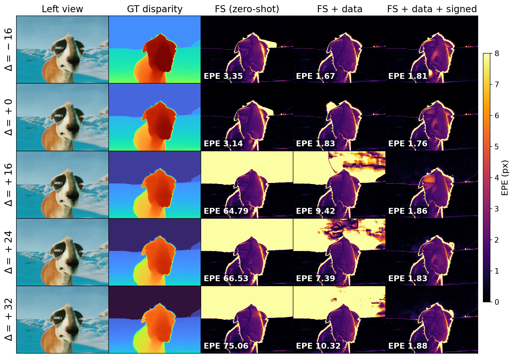

<div align="center">

# ZDPShift: Beyond the Zero-Disparity Plane in Stereo

**Signed stereo matching for content on both sides of the screen.**

[Paper](#) · [arXiv](#) · [Project page](#) · [Dataset](#) · [Weights (HF)](#)



</div>

Modern stereo matchers fail by **19–62×** when disparity becomes negative — yet
stereoscopic content, from cinema 3D to VR, lives in exactly that regime. This
repository provides **fine-tuning and evaluation** for RAFT-Stereo, IGEV-Stereo,
and FoundationStereo on the ZDPShift dataset, including a **signed cost volume**:
a parameter-free generalization of the one-sided cost volume that lets cost-volume
matchers express negative disparity. Pretrained checkpoints load verbatim.

## Install

The three backbones are git submodules under `third_party/`:

```bash
git clone --recursive <this-repo-url> zdpshift
cd zdpshift
# (or, if already cloned:  git submodule update --init --depth 1)

python -m venv .venv && source .venv/bin/activate
pip install torch torchvision --index-url https://download.pytorch.org/whl/cu121
pip install -r requirements.txt
```

| Submodule | Path | Upstream |
|-----------|------|----------|
| FoundationStereo | `third_party/FoundationStereo` | NVlabs/FoundationStereo |
| IGEV-Stereo      | `third_party/IGEV/IGEV-Stereo` | gangweiX/IGEV |
| RAFT-Stereo      | `third_party/RAFT-Stereo`      | princeton-vl/RAFT-Stereo |

Backbone paths resolve to the submodules automatically; pull them (above) or the
imports will error. Each backbone's **SceneFlow init checkpoint** (for training) and
FoundationStereo's **pretrained weights** (for the zero-shot baseline) come from the
upstream repos.

## Weights

Fine-tuned ZDPShift checkpoints go in `weights/` (hosted on Hugging Face; see
[`weights/README.md`](weights/README.md)):

| File | Backbone | Route | mean EPE |
|------|----------|-------|----------|
| `weights/raft_zdpshift.pth`        | RAFT-Stereo      | data recipe          | 0.97 px |
| `weights/igev_zdpshift_signed.pth` | IGEV-Stereo      | + signed cost volume | 0.92 px |
| `weights/fs_zdpshift_signed.pth`   | FoundationStereo | + signed cost volume | **0.76 px** |

## Dataset

Download ZDPShift and point `--dataset` / `--train-root` at the split. A tiny
sample (one scene across all five ZDP shifts) ships under `dataset/eval/` for a
smoke test. Layout:

```
<root>/<split>/<scene>/frame_xxxxx/shift_±N/{left.png, right.png, disparity.npy, meta.json}
```

Signed ground truth follows the rectified-pair geometry `d(Z,Δ) = fB/Z − Δ`.

## Evaluation

```bash
# smoke test on the shipped sample (5 frames)
python eval_foundation_stereo.py --dataset dataset/eval \
    --ckpt weights/fs_zdpshift_signed.pth --signed-volume --d-neg 64 --d-pos 192 --out eval_fs

# full ZDPShift test split
python eval_foundation_stereo.py --dataset <zdpshift>/test --ckpt weights/fs_zdpshift_signed.pth \
    --signed-volume --d-neg 64 --d-pos 192 --out eval_fs
python eval_igev_signed.py       --dataset <zdpshift>/test --ckpt weights/igev_zdpshift_signed.pth \
    --d-neg 64 --d-pos 192 --out eval_igev
python eval_raft_stereo.py       --dataset <zdpshift>/test --ckpt weights/raft_zdpshift.pth --out eval_raft
```

## Fine-tuning

Start from each backbone's public SceneFlow checkpoint. The data recipe (multi-Δ
sampling + SceneFlow rehearsal) fixes the training-distribution blind spot; the
signed cost volume additionally repairs the cost-volume backbones.

```bash
# RAFT-Stereo — data recipe is the whole method (its correlation is already symmetric)
python train_raft_stereo.py --train-root <zdpshift>/train --ckpt-init <raft_sceneflow.pth> \
    --out out_raft --rehearsal-root <sceneflow>

# IGEV-Stereo / FoundationStereo — add the signed cost volume
python train_igev_stereo.py --train-root <zdpshift>/train --ckpt-init <igev_sceneflow.pth> \
    --out out_igev --signed-volume --d-neg 64 --d-pos 192 --rehearsal-root <sceneflow>
python train_foundation_stereo.py --train-root <zdpshift>/train --ckpt-init <fs.pth> \
    --out out_fs --signed-volume --d-neg 64 --d-pos 192 --rehearsal-root <sceneflow>
```

Single RTX 3090 (24 GB), fp16, 30–50k iters (3–10 h).

## Layout

```
models/     signed cost-volume backbones (IGEV, FoundationStereo) + symmetric RAFT
data/       ZDPShift + SceneFlow dataset loaders
train_*.py  fine-tuning entry points
eval_*.py   evaluation (+ evaluate.py helper)
weights/    fine-tuned checkpoints (Hugging Face)
dataset/    sample eval frames
```

## Citation

```bibtex
@inproceedings{zdpshift2027,
  title     = {ZDPShift: Beyond the Zero-Disparity Plane in Stereo},
  author    = {Anonymous Authors},
  booktitle = {Under review at ICLR},
  year      = {2027}
}
```

## License

Code released under the [MIT License](LICENSE). ZDPShift renders derive from
Blender Studio open movies (CC-BY).
